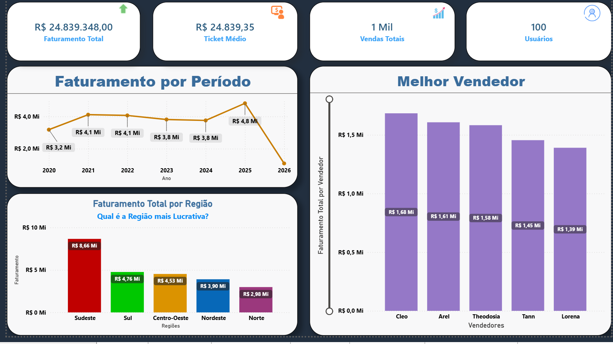
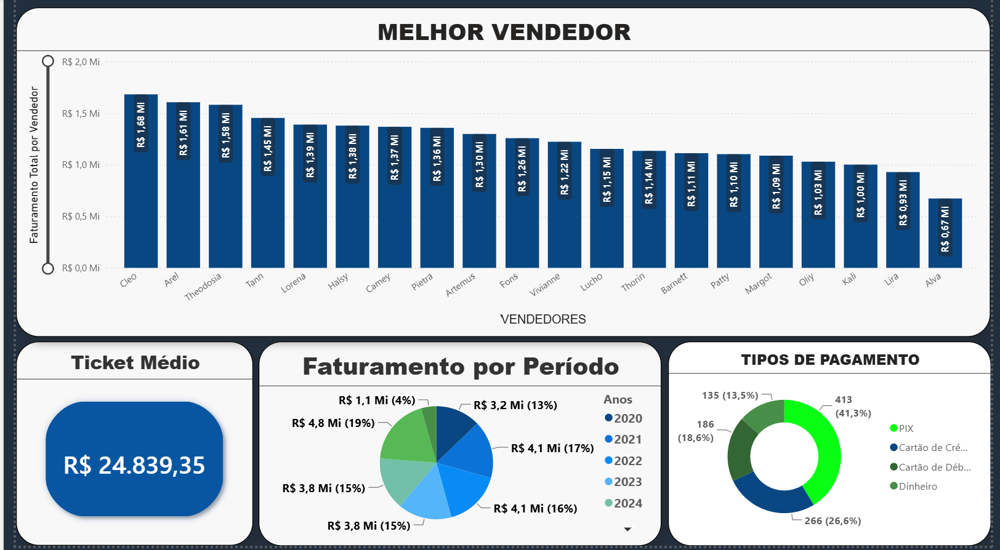
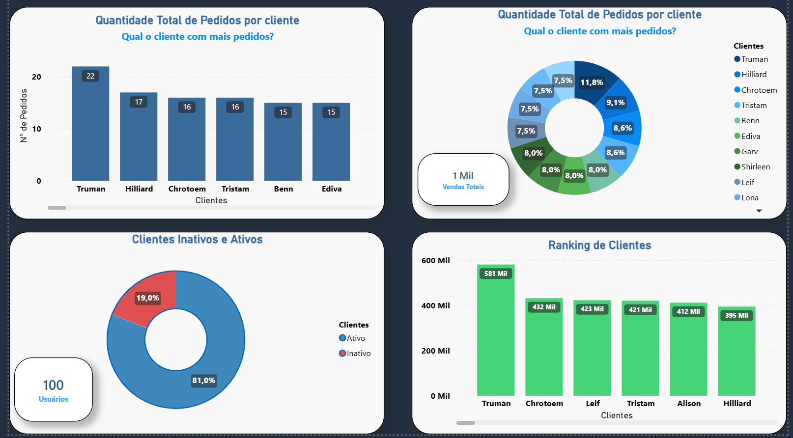
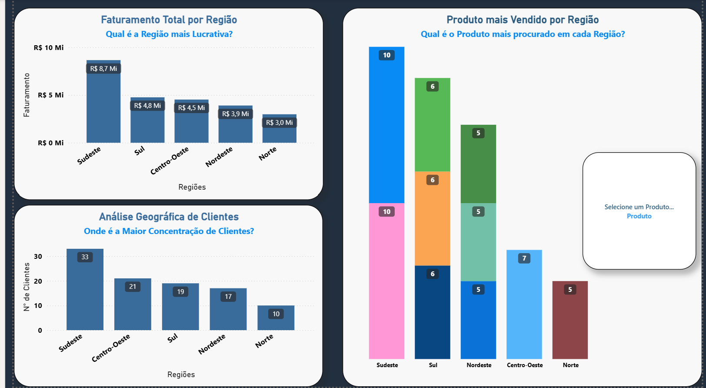

<div align="center">


<br><br>


</div>

---

## Sobre o projeto

Dashboard analítico de vendas, clientes e regiões, construído sobre uma base relacional importada de SQL Server (`db_atividade_bi`). O modelo resolve uma relação muitos-para-muitos entre pedidos e itens através de uma tabela ponte, e responde 14 perguntas de negócio distribuídas em 4 páginas: Executivo, Vendas, Clientes e Região.

Arquivo principal: `Dashboard_Vendas_Clientes_Regiao.pbix`

---

## Modelo de dados

| Tabela | Papel |
|---|---|
| `TB_PEDIDO` | Fato central — um pedido por linha |
| `TB_CAIXA` | Pagamentos, relacionada 1:1 com `TB_PEDIDO` |
| `TB_PEDIDO_HAS_TB_ITEM` | Tabela ponte — resolve M:N entre pedido e item |
| `TB_ITEM` | Dimensão de produto |
| `TB_CLIENTE` | Dimensão de cliente (região, atividade) |
| `TB_VENDEDOR` | Dimensão de vendedor |

**Relacionamentos:**

```
TB_CAIXA (1) ──── (1) TB_PEDIDO
TB_PEDIDO (M) ──── (1) TB_CLIENTE
TB_PEDIDO (M) ──── (1) TB_VENDEDOR
TB_PEDIDO_HAS_TB_ITEM (M) ──── (1) TB_ITEM
TB_PEDIDO_HAS_TB_ITEM (1) ──── (1) TB_PEDIDO
```

---

## Medidas DAX

**Ticket médio**, usando `DIVIDE` (evita erro de divisão por zero) e `DISTINCTCOUNT` (correto aqui, já que um pedido pode ter várias linhas de pagamento):

```dax
Ticket Medio Formatado =
FORMAT(
    DIVIDE(SUM(TB_CAIXA[VL_Pagamento]), DISTINCTCOUNT(TB_CAIXA[ID_Pedido])),
    "R$ #,##0.00"
)
```

**Ranking de produto recalculado por região**, com `RANKX` + `ALLEXCEPT` manipulando o contexto de filtro:

```dax
Rank_Produto_Regiao =
RANKX(
    FILTER(ALL(TB_ITEM[DESC_ITEM]), NOT(ISBLANK([Qtd_Vendida]))),
    CALCULATE([Qtd_Vendida], ALLEXCEPT(TB_CLIENTE, TB_CLIENTE[Regiao])),
    , DESC, DENSE
)
```

> Nota: este modelo não teve etapas de tratamento no Power Query — a carga é uma importação direta das tabelas do SQL Server, sem limpeza ou transformação adicional.

---

## Perguntas de negócio respondidas

1. Faturamento total por região
2. Quantidade total de pedidos por cliente
3. Ticket médio (receita total / nº de pedidos) por pedido
4. Faturamento por período
5. Ranking de vendedores
6. Ranking de cliente
7. Quantidade de itens vendidos
8. Produtos mais vendidos por região
9. Faturamento por vendedor e período
10. Formas de pagamento
11. Clientes ativos x inativos
12. Análise geográfica de clientes
13. Evolução de vendas por vendedor
14. Dashboard executivo final (visão analítica consolidada)

---

## Dashboards

### Executivo — visão consolidada
KPIs de faturamento, ticket médio, vendas totais e usuários, com faturamento por período, por região e melhor vendedor num único painel.



### Vendas — melhor vendedor


### Clientes — pedidos, ranking e status


### Região — faturamento e produto por região


---

## Insights

- A região Sudeste concentra R$ 8,7 Mi em faturamento — quase o dobro da segunda colocada (Sul, R$ 4,8 Mi) — e também tem a maior base de clientes (33), o que sugere que o volume de faturamento acompanha densidade de clientes, não só ticket médio.
- 81% da base de clientes está ativa; os 19% inativos são um alvo direto de campanha de reativação.
- O cliente com mais pedidos (Truman, 22 pedidos) não é o de maior faturamento acumulado — vale cruzar volume de pedido com ticket médio por cliente numa iteração futura do dashboard.

---

## Observação

Dados simulados/fictícios, com finalidade acadêmica e de portfólio.
