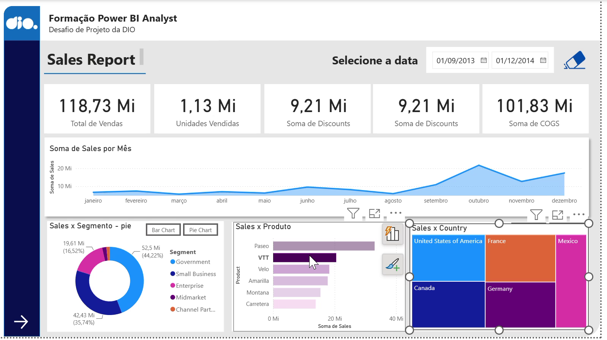
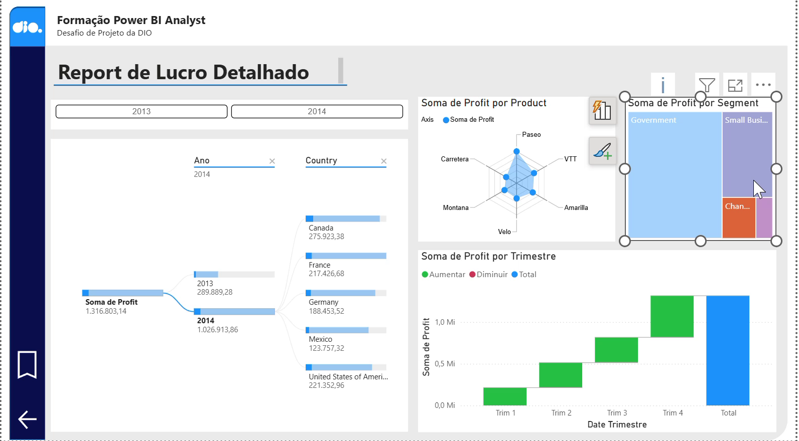
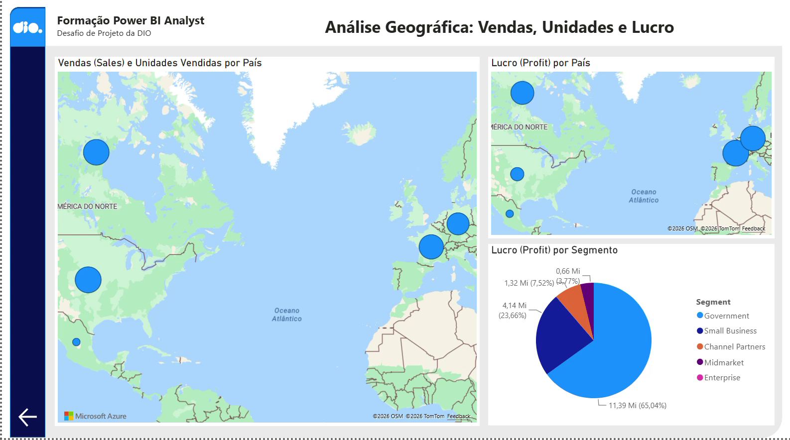
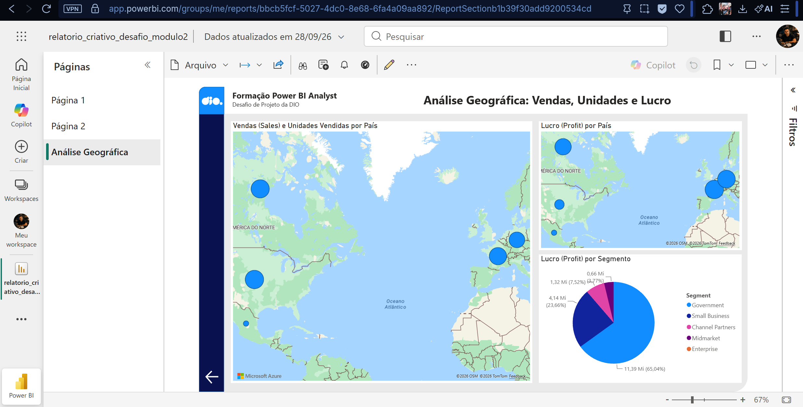

# Desafio de Projeto: Análise de Vendas com Power BI

Desafio do curso **Analisando dados com SQL Analytics e Power BI** (DIO, trilha Universia "Primeiros passos em Power BI"), Módulo 2.
Base de dados: `Financial Sample.xlsx` (700 linhas, 5 países, 5 segmentos), disponibilizada em
[julianazanelatto/power_bi_analyst](https://github.com/julianazanelatto/power_bi_analyst).

**Status: concluído.** O relatório tem 3 páginas (2 replicadas do curso e 1 criada por mim), foi salvo em `.pbix` neste repositório e **publicado no Power BI Service** (Meu workspace, acesso privado).

## Demonstração

### 1. Sales Report (replicada do curso)



<!-- VÍDEO PÁGINA 1: cole aqui a URL https://github.com/user-attachments/assets/... sozinha numa linha, sem colchetes e sem link -->

### 2. Report de Lucro Detalhado (replicada do curso)



<!-- VÍDEO PÁGINA 2: cole aqui a URL https://github.com/user-attachments/assets/... sozinha numa linha, sem colchetes e sem link -->

### 3. Análise Geográfica (criada neste desafio)



<!-- VÍDEO PÁGINA 3: cole aqui a URL https://github.com/user-attachments/assets/... sozinha numa linha, sem colchetes e sem link -->

Os arquivos originais (PNG e MP4) ficam na pasta [`demo/`](demo/).

## Publicação no Power BI Service

O relatório foi publicado no Power BI Service, no **Meu workspace**, com as três páginas e os mapas renderizando. O acesso é privado (conta institucional, sem compartilhamento público), por isso não há link: a evidência é o print abaixo, feito na página **Análise Geográfica** já no Service.



## Conteúdo da pasta

```
relatorio/relatorio_criativo_desafio_modulo2.pbix   relatório com as 3 páginas
dataset/Financial Sample.xlsx                       fonte de dados
demo/                                               prévias (PNG), vídeos curtos (MP4, sem áudio) e print da publicação
docs/GUIA_PAGINA_3_MANUAL.md                        passo a passo para refazer a página 3 no Desktop
docs/conferencia_por_pais.csv                       valores esperados dos mapas
docs/conferencia_por_segmento.csv                   valores esperados da pizza
```

## Páginas do relatório

| Página | Conteúdo | Origem |
|---|---|---|
| 1 | Dashboard de vendas (cards, áreas, barras, treemap, mapa, rosca, filtros) | replicada do curso |
| 2 | Report de lucro detalhado (árvore de decomposição, cascata, radar, treemap) | replicada do curso |
| 3 | **Análise Geográfica** (criada neste desafio) | autoral |

### Página 3: visuais criados

| Visual | Tipo | Campos | Título |
|---|---|---|---|
| Mapa 1 | Mapa (bolhas) | Localização: `Country` · Tamanho: soma de `Sales` · **Dica de ferramenta: soma de `Units Sold`** | Vendas (Sales) e Unidades Vendidas por País |
| Mapa 2 | Mapa (bolhas) | Localização: `Country` · Tamanho: soma de `Profit` | Lucro (Profit) por País |
| Pizza | Gráfico de pizza | Legenda: `Segment` · Valores: soma de `Profit` | Lucro (Profit) por Segmento |

Disposição: mapa de vendas em destaque à esquerda (é o visual principal, com dois campos), mapa de lucro e pizza empilhados à direita. O cabeçalho reaproveita o padrão visual da página 2 (fundo, logo, título, botão de voltar).

## Valores de conferência

Ao abrir o relatório, os visuais da página 3 devem bater com estes números (calculados direto do Excel). Os percentuais da pizza foram conferidos no Power BI Service em 28/09/2026.

**Por país**

| País | Sales | Units Sold | Profit |
|---|---|---|---|
| United States of America | 25.029.830,16 | 232.627,5 | 2.995.540,66 |
| Canada | 24.887.654,88 | 247.428,5 | 3.529.228,88 |
| France | 24.354.172,28 | 240.931,0 | 3.781.020,78 |
| Germany | 23.505.340,82 | 201.494,0 | 3.680.388,82 |
| Mexico | 20.949.352,11 | 203.325,0 | 2.907.523,11 |

**Por segmento (Profit)**

| Segmento | Profit | % do total | % exibido na pizza |
|---|---|---|---|
| Government | 11.388.173,17 | 67,41% | 65,04% |
| Small Business | 4.143.168,50 | 24,52% | 23,66% |
| Channel Partners | 1.316.803,14 | 7,79% | 7,52% |
| Midmarket | 660.103,07 | 3,91% | 3,77% |
| Enterprise | -614.545,62 | -3,64% | não exibido |

## Pontos de atenção nos dados

1. **O segmento Enterprise tem lucro total negativo.** Gráficos de pizza e rosca não representam valores negativos: a fatia do Enterprise não aparece (conferido no Power BI Service, onde ele consta só na legenda), e os percentuais são calculados apenas sobre os segmentos positivos, por isso a coluna "% exibido" difere da coluna "% do total". Se o objetivo for análise e não só o exercício, vale trocar por barras, que mostram o valor negativo. O visual foi mantido como pizza porque é o que o enunciado pede.
2. **A coluna `Sales` chama-se `" Sales"`, com espaço no início**, no Excel de origem. Não quebra os visuais, mas dá erro em DAX e Power Query se você digitar `[Sales]`. Renomear para `Sales` no Power Query é uma boa prática.
3. **Mapas dependem do serviço de mapas do Power BI.** Ao publicar no Power BI Service, o administrador do tenant precisa ter habilitado "Usar visuais de mapa e mapa de preenchimento". Na conta institucional usada aqui, os mapas renderizaram normalmente; em outros tenants, se estiver desabilitado, eles aparecem em branco mesmo funcionando no Desktop.

## Status do desafio

| Item do enunciado | Status |
|---|---|
| Replicar páginas 1 e 2 | Incluídas no arquivo (partem do `relatrio criativo.pbix` do repositório do curso, [julianazanelatto/power_bi_analyst](https://github.com/julianazanelatto/power_bi_analyst)) |
| Mapa 1: sales e unidades por país | Feito |
| Mapa 2: lucro por país | Feito |
| Pizza: lucro por segmento | Feito |
| Disposição dos visuais | Feito |
| Nomes claros nos visuais | Feito |
| Campos nas dicas de ferramenta | Feito (`Units Sold` no mapa 1) |
| Publicar o relatório | Feito: publicado no Power BI Service (Meu workspace, acesso privado). Evidência em `demo/publicado-service.png` |
| Compartilhar no PowerPoint (ou salvar o .pbix) | `.pbix` salvo neste repositório |

## Como abrir

Requer Power BI Desktop (Windows). Três ajustes de ambiente são necessários na primeira abertura:

1. **Fonte de dados:** o Power BI grava o caminho absoluto do Excel. Vá em *Transformar dados → Configurações da fonte de dados → Alterar origem* e aponte para `dataset/Financial Sample.xlsx` da sua cópia. Depois, *Fechar e aplicar* e *Atualizar*.
2. **Visuais personalizados:** a página 2 usa **Chiclet Slicer** e **Radar Chart**. Instale ambos em *Visualizações → … → Obter mais visuais*.
3. **Mapas:** habilite em *Arquivo → Opções e configurações → Opções → Segurança → Usar visuais de mapa e mapa de preenchimento* e reinicie o Desktop.

Depois, abra a página **Análise Geográfica** e compare com os valores de conferência acima. Se preferir refazer a página 3 do zero, siga `docs/GUIA_PAGINA_3_MANUAL.md`.
