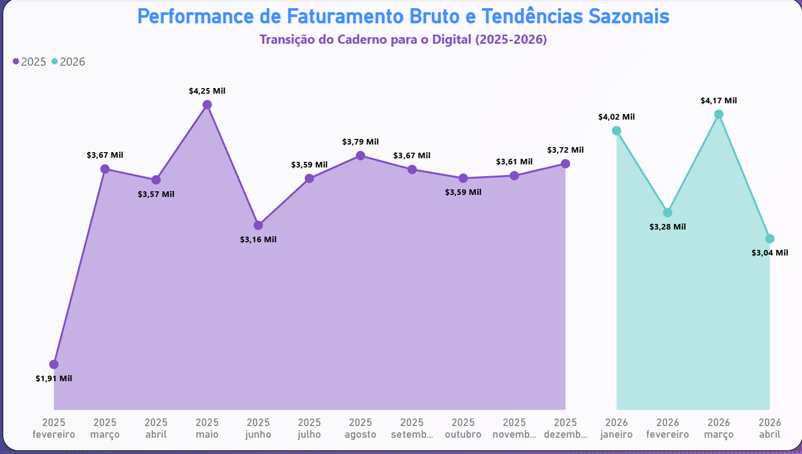
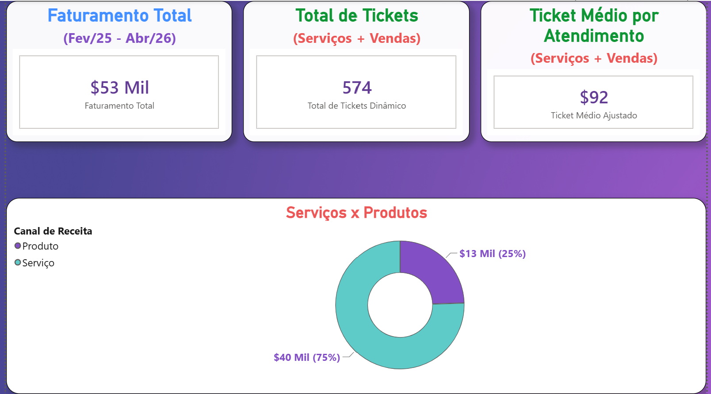
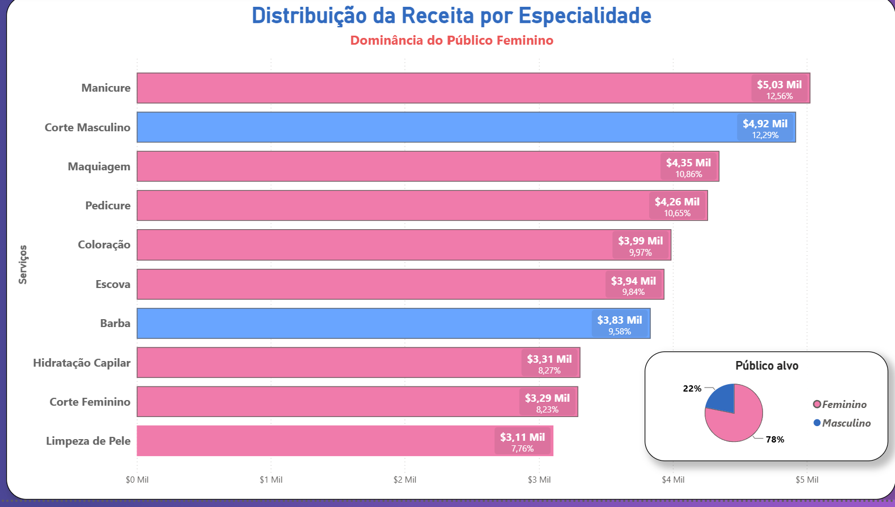
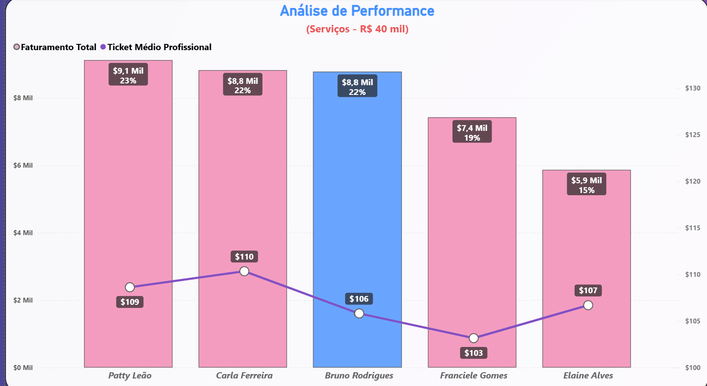
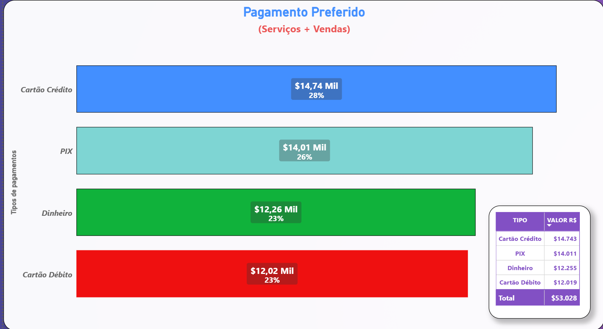
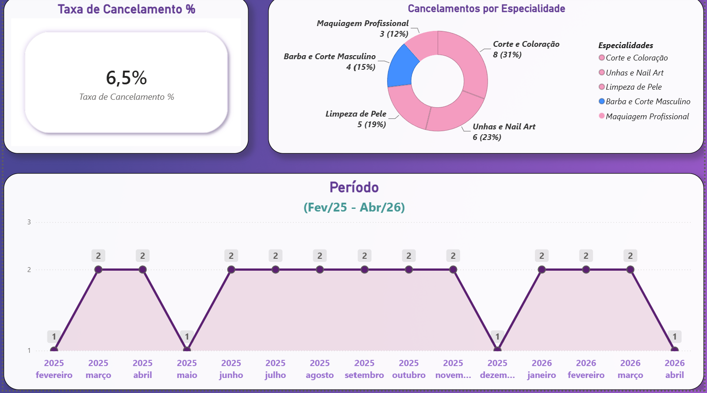
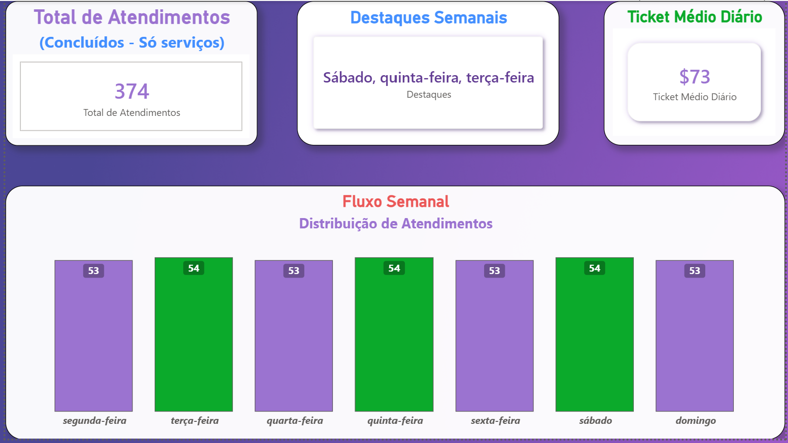
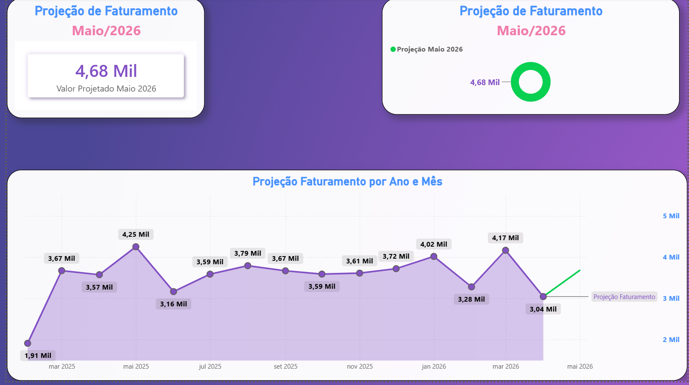

<div align="center">


<br><br>


</div>

---

## Sobre o projeto

Dashboard operacional em Power BI conectado a um banco SQL Server (`studio_patty_leao`) que espelha um sistema real de gestão de salão de beleza — agendamento, caixa, estoque, fornecedores, notas fiscais e vendas de produto. O modelo tem 20 tabelas (incluindo uma view SQL consumida diretamente) e 19 medidas DAX autorais, estruturado como um relatório estratégico que responde 10 perguntas de negócio.

Arquivo principal: `Studio_Patty_Leao_BI.pbix`

---

## Modelo de dados

O schema segue a estrutura operacional do sistema (não é uma tabela única "achatada"):

| Domínio | Tabelas |
|---|---|
| Agenda | `agendamento`, `agendamento_itens`, `vw_agenda_do_dia` (view SQL) |
| Financeiro | `caixa`, `tipo_pagto`, `nf` |
| Pessoas | `cliente`, `profissional`, `usuario`, `admin` |
| Catálogo | `servicos`, `servicos_itens`, `produto` |
| Compras/Estoque | `fornecedor`, `pedido_compra`, `pedido_compra_itens`, `estoque` |
| Vendas | `venda`, `venda_itens` |

**Relacionamentos principais:**

```
agendamento (M) ──── (1) cliente
agendamento_itens (M) ──── (1) profissional
agendamento_itens (M) ──── (1) servicos
caixa (M) ──── (1) agendamento
caixa (M) ──── (1) tipo_pagto
caixa (M) ──── (1) venda
venda (M) ──── (1) cliente
servicos_itens (M) ──── (1) produto   -- consumo de insumo por serviço
```

`servicos_itens` conecta serviço a produto consumido (ex: tinta usada numa coloração) — o modelo distingue serviço prestado de item de estoque baixado, o que é a diferença entre uma modelagem de curso e uma que reflete operação real.

---

## Medidas DAX

**Ticket médio diário**, ignorando o contexto de filtro de agendamento pra calcular sobre todo o período:

```dax
Ticket Médio Diário =
VAR FaturamentoTotal = CALCULATE(SUM('caixa'[valor_movimentado]), REMOVEFILTERS('agendamento'))
VAR DiasTotais = CALCULATE(DISTINCTCOUNT('caixa'[data_hora].[Date]), REMOVEFILTERS('agendamento'))
RETURN DIVIDE(FaturamentoTotal, DiasTotais)
```

**Dia de maior movimento**, com string dinâmica via `CONCATENATEX`:

```dax
Dia de Maior Movimento =
VAR MaxAtendimentos = MAXX(VALUES('agendamento'[Dia da Semana]), [Total Serviços Realizados])
VAR DiasPico = FILTER(VALUES('agendamento'[Dia da Semana]), [Total Serviços Realizados] = MaxAtendimentos)
RETURN UPPER(LEFT(CONCATENATEX(DiasPico, 'agendamento'[Dia da Semana], ", "), 1))
       & RIGHT(CONCATENATEX(DiasPico, 'agendamento'[Dia da Semana], ", "), LEN(...)-1)
```

**Projeção de faturamento**, construída via DAX aplicando taxa de crescimento sobre o histórico do mesmo mês do ano anterior — não é o recurso de forecast automático do Power BI:

```dax
Valor Projetado Maio 2026 =
VAR FaturamentoMaio2025 =
    CALCULATE(SUM('caixa'[valor_movimentado]), YEAR('caixa'[data_hora]) = 2025, MONTH('caixa'[data_hora]) = 5)
RETURN FaturamentoMaio2025 * 1.10
```

**Status de giro de estoque**, classificação condicional:

```dax
Status de Giro =
IF([Total Vendido] = 0, "Encalhado",
   IF([Total Vendido] > 50, "Top Vendas", "Giro Normal"))
```

No Power Query, a tabela `profissional` recebeu renomeação e padronização dos nomes de profissionais para exibição consistente nos dashboards (ex: unificação de "Ana Cabeleireira" → "Patty (Cabeleireira)" → "Patty Leão").

---

## Perguntas de negócio respondidas

1. Como está a saúde financeira do Studio ao longo do tempo?
2. Qual é o ticket médio das nossas clientes?
3. A "Vitrine Digital" funciona? Qual a diferença de ganho entre serviços e produtos de balcão?
4. Quais são os 10 serviços que mais trazem dinheiro para o salão?
5. Quem são os profissionais "top performers" (que mais faturam)?
6. Qual é o meio de pagamento preferido?
7. Qual é a nossa taxa de cancelamento de agendamentos?
8. Quais são os dias da semana de maior movimento?
9. Quais produtos de revenda estão encalhados e quais saem mais?
10. Com base no histórico de 2025, o que devemos esperar para o próximo mês?

---

## Dashboards

### Saúde financeira — sazonalidade 2025/2026


### Resumo financeiro — ticket, tickets totais e mix serviço x produto


### Receita por especialidade


### Top performers — faturamento e ticket médio por profissional


### Meio de pagamento preferido


### Taxa de cancelamento


### Fluxo semanal de atendimentos


### Projeção de faturamento — maio/2026


---

## Insights

- Cartão de crédito (28%) e PIX (26%) somados respondem por mais da metade do volume financeiro — meios de pagamento instantâneo/digital já superam dinheiro (23%) e débito (23%) juntos.
- A taxa de cancelamento (6,5%) tem padrão sazonal visível: picos em meses específicos e vale em maio/dezembro — sugere relação com épocas de maior demanda, não distribuição aleatória.
- Manicure e Corte Masculino lideram receita por especialidade quase empatados (R$ 5,03 Mi e R$ 4,92 Mi), mesmo com público majoritariamente feminino (78%) — o corte masculino tem ticket desproporcional ao tamanho da base de clientes homens.
- A projeção de maio/2026 (R$ 4,68 Mi) assume repetição do padrão sazonal de maio/2025 com 10% de crescimento — é uma projeção simples, não estatística, útil como referência rápida mas não substitui um modelo de séries temporais.

---

## Relação com o projeto principal

Este dashboard é a camada analítica do sistema **Studio Patty Leão — Sistema Operacional de Salão**, conectado diretamente ao banco de dados da aplicação.

---

## Observação

Dados simulados/fictícios, com finalidade acadêmica e de portfólio.
